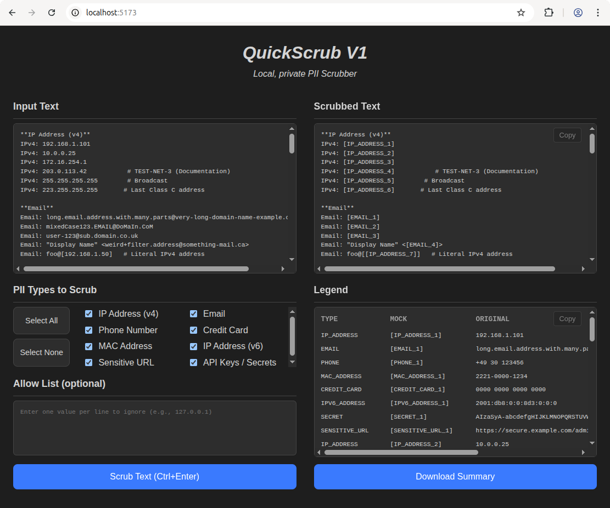

<p align="center">
  
</p>

QuickScrub is a high-performance, locally-hosted application designed for detecting and redacting Personally Identifiable Information (PII) from text. It features a clean, modern web-based user interface and a powerful, easily extensible backend built with Python and FastAPI.

A core design principle of QuickScrub is data privacy. The application operates entirely on your local machine, ensuring that no sensitive data is ever transmitted over the network or processed by third-party services. This allows users to scrub documents with the highest level of confidence and security.

---

## Table of Contents

- [Core Features](#core-features)
- [Technology Stack](#technology-stack)
- [Getting Started](#getting-started)
  - [Prerequisites](#prerequisites)
  - [Option 1: Running with Docker (Recommended)](#option-1-running-with-docker-recommended)
  - [Option 2: Local Installation](#option-2-local-installation)
- [Application Usage](#application-usage)
  - [Web UI](#web-ui)
  - [Command-Line Interface (CLI)](#command-line-interface-cli)
  - [API Endpoint](#api-endpoint)
- [Extending QuickScrub](#extending-quickscrub)
- [Project Structure](#project-structure)
- [License](#license)

---

## Core Features

- **Complete Data Privacy:** All processing is performed locally. Your data never leaves your machine, providing an unparalleled level of security and privacy.
- **Modern Web Interface:** A responsive and intuitive user interface, built with vanilla JavaScript and Vite, allows for easy interaction, text scrubbing, and configuration.
- **Modular Recognizer Architecture:** The system is built to be highly extensible. New PII recognizers can be added by simply creating a new Python class; the application's registry will discover and integrate them automatically at startup.
- **Intelligent Conflict Resolution:** The scrubbing engine is designed to gracefully handle cases where multiple recognizers identify overlapping text, ensuring the most accurate and comprehensive finding is prioritized.
- **Configurable Allow Lists:** Users can specify a list of values (such as a local IP address or a specific email) that should be explicitly ignored by the scrubbing engine, preventing false positives.
- **Containerized Deployment:** A multi-stage `Dockerfile` is included for building a lightweight, production-ready container, simplifying deployment and ensuring environment consistency.
- **Comprehensive PII Detection:** The default recognizers support a wide range of sensitive data types:
  - IP Addresses (IPv4 and IPv6)
  - Email Addresses
  - Phone Numbers (North American Numbering Plan)
  - Credit Card Numbers (validated using the Luhn algorithm)
  - MAC Addresses
  - Potentially Sensitive URLs (containing tokens or secrets)
  - Generic Secrets (using a high-entropy detection algorithm)

## Technology Stack

- **Backend:** Python 3.10+, FastAPI, Pydantic
- **Frontend:** Vanilla JavaScript (ESM), Vite, HTML5, CSS3
- **Command-Line Interface:** Typer
- **Testing Framework:** Pytest
- **Containerization:** Docker

## Getting Started

### Prerequisites

- **For Local Installation:** Requires Python 3.8+ and Node.js 18+ to be installed on your system.
- **For Docker Deployment:** Requires a running Docker Engine.

---

### Option 1: Running with Docker (Recommended)

This method is the most straightforward approach, as it encapsulates all dependencies within a container and does not require installing Python or Node.js on your host machine.

1.  **Build the Docker Image:**
    From the root of the project directory, execute the build command:
    ```bash
    docker build -t quickscrub .
    ```

2.  **Run the Docker Container:**
    Launch the container using the following command:
    ```bash
    docker run -d -p 8000:8000 --name quickscrub-app quickscrub
    ```
    - The `-d` flag runs the container in detached mode (in the background).
    - The `-p 8000:8000` flag maps port 8000 on your host machine to port 8000 inside the container.

The application will then be accessible at `http://127.0.0.1:8000`.

---

### Option 2: Local Installation

This approach is suitable for developers who wish to run the application directly on their machine.

1.  **Clone the Repository:**
    ```bash
    git clone https://github.com/camdoherty/QuickScrub.git
    cd QuickScrub
    ```

2.  **Set up the Python Virtual Environment:**
    It is highly recommended to use a virtual environment to manage dependencies.
    ```bash
    python3 -m venv venv
    source venv/bin/activate
    pip install -e ".[dev]"
    ```
    *The `-e` flag installs the project in "editable" mode, which allows you to make changes to the source code without reinstalling.*

3.  **Build the Frontend Assets:**
    The frontend requires its own dependency installation and build step.
    ```bash
    cd frontend
    npm install
    npm run build
    cd ..
    ```

4.  **Run the Development Server:**
    From the project root directory, start the Uvicorn server:
    ```bash
    uvicorn QuickScrub.main:app --reload
    ```
    The `--reload` flag enables hot-reloading, automatically restarting the server when code changes are detected. The application will be available at `http://127.0.0.1:8000`.

## Application Usage

QuickScrub can be used via its web interface, a command-line tool, or its REST API.

### Web UI

1.  Navigate to `http://127.0.0.1:8000` in your web browser.
2.  Paste the text you wish to analyze into the "Input Text" field.
3.  Select the PII types you want to detect and scrub.
4.  Optionally, add any values to the "Allow List" to prevent them from being redacted (one value per line).
5.  Click the **Scrub Text** button or use the `Ctrl+Enter` keyboard shortcut.
6.  The scrubbed text and a legend mapping redacted placeholders to their original values will appear in the output panels.

### Command-Line Interface (CLI)

QuickScrub includes a full-featured CLI for scripting and automation. After installation (`pip install .`), the `quickscrub` command becomes available.

**Commands:**

-   `quickscrub scrub`: The primary command for scrubbing text from standard input or a string.
-   `quickscrub types`: Lists all available PII recognizer types.

**Examples:**

1.  **Scrub text piped from a file:**
    ```bash
    cat sensitive_document.txt | quickscrub
    ```

2.  **Scrub only specific PII types:**
    ```bash
    cat sensitive_document.txt | quickscrub --type EMAIL --type IP_ADDRESS
    ```

3.  **Scrub text passed as a direct argument:**
    ```bash
    quickscrub "The server IP is 192.168.1.100 and the admin is admin@corp.local"
    ```

4.  **Use an allow list file to ignore specific values:**
    Create a file named `allow.txt` containing `192.168.1.100`, then run:
    ```bash
    quickscrub "The server IP is 192.168.1.100" --allow-list allow.txt
    ```

5.  **Get structured JSON output, including the legend:**
    ```bash
    cat sensitive_document.txt | quickscrub --json
    ```

For a full list of options and commands, run `quickscrub scrub --help`.

### API Endpoint

The backend exposes a RESTful API for programmatic integration.

**`POST /api/scrub`**

-   **Content-Type:** `application/json`
-   **Request Body Schema:**
    ```json
    {
      "text": "string",
      "types": ["list", "of", "type", "tags"],
      "allow_list": ["optional", "list", "of", "strings"]
    }
    ```
-   **Example with `curl`:**
    ```bash
    curl -X POST http://127.0.0.1:8000/api/scrub \
    -H "Content-Type: application/json" \
    -d '{
      "text": "Contact support at support@example.com or on the internal IP 10.0.0.55. Ignore 127.0.0.1.",
      "types": ["EMAIL", "IP_ADDRESS"],
      "allow_list": ["127.0.0.1"]
    }'
    ```

## Extending QuickScrub

The modular design makes it exceptionally easy to add new PII recognizers.

1.  Create a new Python file in the `QuickScrub/recognizers/` directory (e.g., `ssn_recognizer.py`).
2.  Inside that file, define a new class that inherits from the `Recognizer` base class (found in `QuickScrub.recognizers.base`).
3.  In your class's `__init__` method, call the parent constructor with the recognizer's name and a unique tag: `super().__init__(name="Social Security Number", tag="SSN")`.
4.  Implement the `analyze(self, text: str) -> List[Finding]` method. This method must scan the input text and return a list of `Finding` objects for each match it discovers.
5.  No further registration is needed. The application's recognizer registry will automatically detect and load your new module upon startup.

## Project Structure

```
QuickScrub/
├── Dockerfile              # Defines the multi-stage Docker build process.
├── frontend/               # Contains all frontend source code and assets.
│   ├── src/                # JavaScript and CSS source files.
│   ├── index.html          # Main HTML entrypoint.
│   └── vite.config.js      # Vite build configuration.
├── QuickScrub/             # The primary Python package for the backend application.
│   ├── __init__.py
│   ├── main.py             # FastAPI application entrypoint, middleware, and static file serving.
│   ├── cli.py              # Defines the Typer-based command-line interface.
│   ├── api/                # Contains API endpoint definitions.
│   ├── core/               # Core application logic (scrubbing engine, recognizer registry).
│   ├── models/             # Pydantic and Dataclass models for data structures.
│   ├── recognizers/        # Directory for all PII recognizer plugins.
│   │   ├── base.py         # Contains the abstract base classes for recognizers.
│   │   └── ...             # Individual recognizer implementations.
│   └── tests/              # Pytest unit and integration tests.
├── pyproject.toml          # Project metadata and Python dependencies (PEP 621).
└── README.md               # This documentation file.
```

## License

This project is licensed under the terms of the MIT License. Please see the `LICENSE` file for full details.
